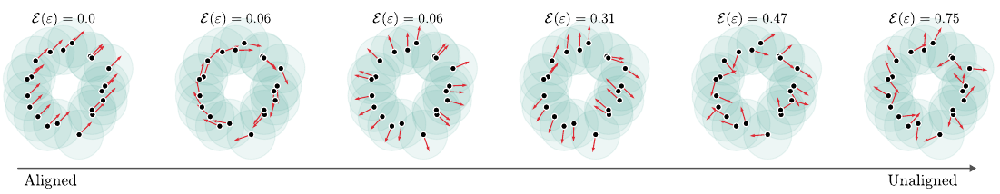

# Attributes Shape the Embedding Space of Face Recognition Models

This repository contains the official implementation of the [paper](https://openreview.net/forum?id=VY74pP1w93):

> **Attributes Shape the Embedding Space of Face Recognition Models**  
> Pierrick Leroy, Antonio Mastropietro, Marco Nurisso, Francesco Vaccarino  
> *Forty-second International Conference on Machine Learning (ICML)*

# Table of contents

1. [Introduction](#introduction)  
   - [Summary](#summary)  
   - [Embeddings](#embeddings)  
2. [Macroscale analysis](#macroscale-analysis-)  
   - [Datasets and preprocessing](#datasets-and-preprocessing)  
   - [Macroscale experiment](#macroscale-experiment)  
3. [Microscale analysis](#microscale-analysis-)  
   - [Data generation with generative models](#data-generation-with-generative-models)  
   - [Microscale experiment](#microscale-experiment)
4. [Requirements](#requirements)
5. [Bibliography](#bibliography)

# Introduction

## Summary


In this work, we investigate how attributes influence the embedding space of deep learning models.
While we focus on face recognition models like FaceNet, ArcFace and AdaFace, the methodology can be adapted to other domains. 
By analyzing the relationship between attributes (in our case, facial attributes) and embeddings, we provide insights into the sensitivity and structure of models. 

A peculiarity of the embedding space of Face Recognition models is that they have a hierarchical structure (see image).
This can be the case more generally for models trained by contrastive losses on classes.
This is important for our analysis since we have broken down embedding space analysis at two different scale:\
👨 The *macroscale* is the scale where all photos of an identity are indistinguishable\
📷 The *microscale* is more granular and is the scale of photos of a single individual

This repository includes the code and scripts to reproduce the experiments and results presented in the paper.


## Embeddings

In this work we analyze the *embedding space*.
To produce embeddings, a function mapping from the input space (face images) to the embedding space is needed.
The embeddings were produced by a variety of models coming from different repositories reported in the following table:
| Model      | Architecture | Metric    | Train Set | Images (M) | Source Repository            |
|------------|--------------|-----------|-----------|------------|------------------------------|
| FaceNet    | iResNetv1    | euclidean | VGGFace2  | 3.31       | [davidsandberg/facenet](https://github.com/davidsandberg/facenet)        |
| ArcFace    | ResNet50     | cosine    | MS1MV3    | 5.18       | [deepinsight/insightface](https://github.com/deepinsight/insightface)      |
| ArcFace    | ResNet18     | cosine    | MS1MV3    | 5.18       | [deepinsight/insightface](https://github.com/deepinsight/insightface)      |
| AdaFace    | ResNet18     | cosine    | VGGFace2  | 3.31       | [mk-minchul/AdaFace](https://github.com/mk-minchul/AdaFace)           |
| SphereFaceR| iResNet100   | cosine    | MS1       | 10         | [ydwen/opensphere](https://github.com/ydwen/opensphere)             |


# Macroscale analysis 👨

## Datasets and preprocessing

The macroscale analysis is performed on the **CelebA** dataset.
The raw **Labelled Faces in the Wild **(LFW) dataset is used as a sanity check to verify that models perform well on this easy dataset and for instance to produce these histograms of distances on the face *verification task* i.e. classifying pairs of images as matching or non-matching:


Links to datasets:\
💾 [CelebA](https://mmlab.ie.cuhk.edu.hk/projects/CelebA.html). \
💾 [LFW(aligned)](https://www.kaggle.com/datasets/jessicali9530/lfw-dataset). (Note: the raw version used in the paper has been deprecated)

We did some custom preprocessing on CelebA and LFW to subsample a higher quality subsets.
The 7 preprocessing steps we took are by no means a gold standard.
They are described precisely in [scripts/face/README.md](scripts/face) and reported on the flow chart below.
The objective of the preprocessing is to address common issues like:
- filter out obvious mislabels
- discard images with no clean face
- discard images with multiple possible faces


## Macroscale experiment

🎯 The core of the macroscale analysis can be found in the notebook at [notebooks/face/experiment_distance_macroscale.ipynb](notebooks/face).\
In this notebook the following steps are done for the 5 models described in [this table](#embeddings)
1. Loading of a preprocessed (high quality subset) of CelebA
2. Computation of attributes intra- (and inter-) entropies
3. Computation of distance distribution in the embedding space, KS-statistics and aggregation of the results
4. Correlations between the KS-statistics and the entropies
5. A few visualizations of the results

# Microscale analysis 📷

## Data generation with generative models

For the **microscale analysis**, we used GanControl ([paper](https://arxiv.org/abs/2101.02477), [code](https://github.com/amazon-science/gan-control)) to generate fake individuals with many variations.
We generate data on a structured lattice as described in the paper, allowing us to design segments in image space along which a single attribute varies (see rows in image below).
Each node of the lattice (corresponding to a face image) can then be embedded with multiple face recognition models and a vector field can finally be derived, see the paper for a precise explanation.
This repository does not provide code for generating image, this part is done with GAN-control, but here is the type of command that we used on GAN-control


```python 
[controller.gen_batch_by_controls(latent=initial_latent_w, input_is_latent=True,age=x)[0] for x in segment_age]
```
With this code, we generate image along a segment with orientation varying step by step according to the pre-defined `segment_age`  while other attributes stay fixed.
We can do this for the other default attributes proposed by GAN-control, for example hair:
```python 
[controller.gen_batch_by_controls(latent=initial_latent_w, input_is_latent=True,hair=x)[0] for x in segment_hair]
```
The produced image would look something like this:


Then, these images can be readily embedded with the face recognition models from [this table](#embeddings) or others.


## Microscale experiment

The script at [scripts/topo/energy_finetuning_jax.py](scripts/topo/) processes embedded gan control generated images.\
In addition, you can see the notebook [notebooks/energy/energy_gancontrol.ipynb](notebooks/energy) to see how the energies are computed for two models.

The paper introduces a, "energy" metric quantifying invariance, it is implemented in [scripts/topo/energy_finetuning_jax.py](scripts/topo/).

The goal of this metric is to quantify how disordered a normalized vector field is (see image below). This in turn will quantify the unpredictability (~invariance) that changes in input space have in the embedding space.




# Requirements
To run the code, you need to install the following dependencies:

```bash
conda env create --name envname --file=environment_updated.yml
```

# Bibliography
If you use this code in your research, please cite our paper:

```
@inproceedings{leroyattributes,
  title={Attributes Shape the Embedding Space of Face Recognition Models},
  author={Leroy, Pierrick and Mastropietro, Antonio and Nurisso, Marco and Vaccarino, Francesco},
  booktitle={Forty-second International Conference on Machine Learning (ICML)},
  year={2025}
}
```
